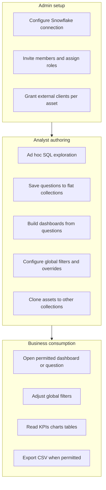

# Dashboardy — Design Brief

**Purpose**: Product and UX brief for creating a design system from scratch.  
**Audience**: Design agents and designers building foundations, components, and patterns.  
**Domain**: `dashboardy.app`

This document describes what Dashboardy is, who it serves, what experiences it must support, and the interaction constraints that shape those experiences. It does **not** prescribe visual style, brand personality, or reference any existing implementation.

---

## 1. Product overview

### What Dashboardy is

Dashboardy is an **expert-authored, business-consumed** internal BI platform. BI analysts and admins create governed SQL, save reusable analytical assets, and assemble dashboards. Business leaders, internal viewers, and external clients consume those dashboards and saved outputs without writing SQL.

### Core product goal

Enable organizations to:

1. **Author** trusted, governed analytics from a Snowflake data warehouse.
2. **Organize** reusable saved questions and dashboards in flat collections with clear permissions.
3. **Consume** multi-metric dashboards with interactive filters and predictable refresh behavior.
4. **Share** insights internally via collection access and externally via explicit per-asset grants.
5. **Export** bounded CSV outputs when permissions allow.

### What Dashboardy is not (MVP)

Dashboardy is **not** a general-purpose self-serve BI platform in MVP. Users cannot build queries through a visual query builder, receive AI-generated insights, or explore data without expert-authored SQL behind the scenes.

### Data and trust boundary

| Layer | Role |
|-------|------|
| **Snowflake** | Analytical source of truth; real data access control lives here |
| **Application database** | Metadata only: users, permissions, dashboard definitions, connection references, audit logs, short-TTL result cache |
| **Users' browsers** | Presentation and interaction; no durable warehouse data storage |

The product must communicate this boundary clearly: users trust what they see because scope, filters, and freshness are understandable — not because the app silently caches or hides analytical context.

### Tenancy model (MVP)

- **Multi-tenant**: every resource belongs to exactly one tenant.
- **Workspace-scoped**: memberships, collections, and assets live within a workspace.
- **MVP simplification**: one workspace per tenant. Navigation and IA can assume a single workspace context per signed-in tenant.

---

## 2. Users and roles

All roles are scoped per workspace. A user may hold different roles in different workspaces.

### Role summary

| Role | Primary job | Typical user |
|------|-------------|--------------|
| **Admin** | Platform governance: connections, membership, external grants | IT / platform owner, head of BI |
| **Analyst** | Author SQL, saved questions, dashboards; clone assets | BI analyst, data engineer |
| **Viewer** | Consume permitted dashboards and questions; filter and export | Executive, GM, internal stakeholder |
| **External client** | View explicitly granted assets only | Customer, partner, board observer |

### Capability matrix

| Capability | Admin | Analyst | Viewer | External client |
|------------|:-----:|:-------:|:------:|:---------------:|
| Manage Snowflake connection | Yes | — | — | — |
| Invite members, assign roles | Yes | — | — | — |
| Grant external clients per-asset access | Yes | — | — | — |
| Write and run ad hoc SQL | Yes | Yes | — | — |
| Create/edit saved questions | Yes | Yes | — | — |
| Create/edit dashboards and widgets | Yes | Yes | — | — |
| Manage collections (create, rename, delete) | Yes | Yes* | — | — |
| Clone questions and dashboards | Yes | Yes | — | — |
| View dashboards and questions | Yes | Yes | Yes | Yes** |
| Use dashboard global filters | Yes | Yes | Yes | Yes** |
| Export CSV | Yes | Yes | Yes | Yes*** |
| See raw SQL or connection details | Yes | Yes | — | — |

\* Within permitted collection scope.  
\** Only explicitly granted assets for external clients; no browsing of unrelated workspace content.  
\*** External clients require a separate explicit export grant on the asset.

### Information hiding by role

Design must enforce a hard split between **authoring surfaces** and **consumption surfaces**:

- **Viewers and external clients** never see: raw SQL, connection metadata, credential status, collection administration, widget configuration, or clone/author actions.
- **External clients** see only assets explicitly granted to them — not the full workspace library.
- **Analysts** cannot manage connections or workspace membership.

---

## 3. Core user journeys

### Journey map

### 3.1 Admin setup

**Goal**: Establish a secure, tested link to Snowflake and onboard the right people with the right access.

| Step | User action | Success criteria | Design notes |
|------|-------------|------------------|--------------|
| 1 | Configure tenant Snowflake connection | One connection per tenant; credentials never displayed after submission | Show connection status lifecycle: `not_configured` → `pending_test` → `active` or `test_failed` |
| 2 | Test connection | Admin sees pass/fail with sanitized error; no secrets in UI or errors | Last-tested timestamp always visible on active connections |
| 3 | Rotate credentials | New credentials active only after successful test; old credentials not shown | Clear before/after state; rotation in progress must not leave ambiguous status |
| 4 | Invite members | User receives invite, signs in, lands in workspace with assigned role | Role assignment is explicit and reviewable |
| 5 | Grant external client access | Client sees only granted dashboards/questions | Grant UI is per-asset; no collection-level inheritance for external clients |

**Edge cases to design for**:

- Tenant has no connection: dependent surfaces show a setup-required state, not a generic failure.
- Connection test fails: actionable, sanitized message; previous active state preserved on failed rotation.
- Admin loses privileges mid-session: subsequent management actions denied immediately.

### 3.2 Analyst authoring loop

**Goal**: Turn governed SQL into reusable, shareable analytical assets and executive-ready dashboards.

| Step | User action | Success criteria | Design notes |
|------|-------------|------------------|--------------|
| 1 | Run ad hoc SQL | Results within timeout and row limits; execution logged | Ad hoc runs are never cached; user can distinguish ad hoc from saved-question runs |
| 2 | Create collection | Flat folder created; unique name within workspace | No nested collections in MVP |
| 3 | Save question | Title, description, SQL, declared parameters stored in collection | Parameters: `string`, `number`, `boolean`, `date` |
| 4 | Run saved question | Valid parameters → governed results; invalid → refusal before warehouse work | Parameter prompts must explain type and requirement clearly |
| 5 | Create dashboard | Dashboard in collection; widgets backed by accessible saved questions | Widget types: KPI (scalar), bar, line, table only |
| 6 | Configure layout | Widgets repositioned on grid; configuration persisted | Author sees layout tools; consumers do not |
| 7 | Configure global filters | Filters mapped to saved-question parameters with explicit widget bindings | Only bound widgets respond to a given filter |
| 8 | Set per-widget overrides | Override visible to consumers; hidden divergence forbidden | Override indicator in widget chrome |
| 9 | Clone asset | New copy in target collection; new owner; permissions follow target collection | Source asset unchanged; no permission leakage from source |

**Edge cases to design for**:

- Duplicate title in same collection: rejected with clear message.
- Collection delete with active questions/dashboards: refused until empty.
- Stale concurrent edit: rejected when asset changed since load.
- Row limit exceeded: typed outcome with guidance to narrow the query.
- Force fresh run: user can bypass cache and get newly evaluated results.

### 3.3 Business consumption loop

**Goal**: Answer business questions quickly with trustworthy, filter-driven views.

| Step | User action | Success criteria | Design notes |
|------|-------------|------------------|--------------|
| 1 | Open dashboard or saved question | Permitted asset loads; unauthorized assets refused at open time | Stale list entries must not imply access |
| 2 | Read default filter state | Defaults come from dashboard definition, not user identity | First open applies configured defaults |
| 3 | Change global filter | All widgets with explicit binding auto-refresh immediately | Unbound widgets do not silently change |
| 4 | Interpret widget with override | Consumer sees that widget differs from global filter bar | Override indicator always visible when active |
| 5 | Page through table | Client-side paging over server-capped result set | No unbounded "load more" warehouse requests |
| 6 | Export CSV | Synchronous download; ≤10,000 rows; same filter state as view | Export permission separate from view permission |
| 7 | Force refresh | User bypasses cache; widgets show fresh execution | Freshness/cache state understandable |

**Edge cases to design for**:

- Invalid filter value: affected widgets refuse before warehouse work; explain which filter failed.
- Access revoked after list load: open, filter, and refresh all denied at action time.
- Query queued under load: deterministic queued state, not a generic error.
- Warehouse busy (queue full): typed `warehouse_busy` with graceful retry/hold UX.
- External client without export grant: export action absent or clearly denied.

---

## 4. Application surfaces

Inventory of modules and screens the design system must support. This is an information-architecture list — not a layout or component specification.

### 4.1 Authentication and session

- Sign in (email/password via shared auth provider)
- Sign out
- Session expiry and re-authentication
- Post-login landing in workspace context

### 4.2 Workspace shell and navigation

- Primary navigation between major areas: collections, saved questions, dashboards, admin (role-gated)
- Workspace context indicator (tenant/workspace identity)
- User menu: profile, sign out
- Permission-aware navigation: hide or disable unreachable areas by role

### 4.3 Admin — data connection

- Connection setup form (first-time configuration)
- Connection detail: metadata, status, last test result
- Test connection action and result feedback
- Credential rotation flow
- Status states: `not_configured`, `pending_test`, `active`, `test_failed`

### 4.4 Admin — membership

- Member list with roles
- Invite member by email
- Change member role
- Deactivate member

### 4.5 Admin — external client grants

- Grant external client access to a specific dashboard or saved question
- Optional export permission toggle per grant
- Revoke grant
- No collection-level grant for external clients

### 4.6 Collections

- Flat collection list (no nesting)
- Create, rename, delete collection
- Collection detail: contained saved questions and dashboards
- Permission indicators (view / edit) at collection level
- Empty collection state

### 4.7 Saved questions

- Question list (filtered by collection and permissions)
- Question detail: title, description, parameter declarations
- Question editor: SQL, parameters, collection assignment
- Run question: parameter input → results view
- Clone question to target collection
- Soft delete
- Force fresh run (cache bypass)

### 4.8 SQL authoring and execution

- Ad hoc SQL editor and run surface (admin and analyst only)
- Saved-question SQL editor with parameter declaration UI
- Execution result presentation (tabular)
- Execution status and typed outcomes
- Row count and limit indicators
- No SQL surface for viewers or external clients

### 4.9 Dashboard builder (authoring)

- Dashboard list (filtered by collection and permissions)
- Create dashboard in collection
- Dashboard canvas with layout grid
- Add widget: select saved question, choose type (KPI, bar, line, table)
- Widget configuration and repositioning
- Global filter configuration: declare filters, set defaults, bind to widget parameters
- Per-widget filter override configuration
- Dashboard metadata: title, collection, description
- Clone dashboard to target collection
- Soft delete

### 4.10 Dashboard consumption

- Dashboard view with global filter bar
- Multi-widget layout with independent loading states per widget
- Widget presentations:
  - **KPI**: single scalar value
  - **Bar chart**: categorical comparison
  - **Line chart**: trend over dimension
  - **Table**: columnar data with client-side pagination
- Per-widget override indicators
- Force refresh (cache bypass) per widget or dashboard
- No authoring controls for viewers and external clients

### 4.11 Export

- CSV export from saved question results
- CSV export from dashboard table widgets
- Export uses current filter/parameter state
- 10,000-row hard cap with clear messaging when exceeded
- Export gated by separate permission for external clients

### 4.12 Sharing and permissions (internal)

- Collection-level grants: `view`, `edit`
- Per-question and per-dashboard grants that widen access only
- Export permission as separate explicit grant
- No deny rules: restrictions expressed by removing access, not layering denies

### 4.13 System feedback states

Design patterns needed across all surfaces:

| State type | Examples |
|------------|----------|
| **Loading** | Shell skeleton, per-widget loading, query queued |
| **Empty** | No collections, no questions, no dashboards, no results |
| **Success** | Execution `ok`, connection `active` |
| **Refusal** | `authz_denied`, invalid parameters, duplicate name |
| **Execution failure** | `timeout`, `row_limit_exceeded`, `rejected_by_parser`, `warehouse_error` |
| **Capacity** | `warehouse_busy`, queued execution |
| **Setup required** | No connection configured |
| **Stale access** | Asset visible in list but denied on open |

---

## 5. Domain terminology

Use these terms consistently in labels, navigation, component names, and documentation.

| Term | Definition |
|------|------------|
| **Tenant** | Customer organization boundary; all resources are tenant-scoped |
| **Workspace** | User working area within a tenant; MVP assumes one workspace per tenant |
| **Member** | Signed-in user with a workspace membership and one role |
| **Collection** | Flat folder holding saved questions and dashboards; no nesting in MVP |
| **Saved question** | Reusable governed SQL with declared scalar parameters |
| **Dashboard** | Canvas of widgets backed by saved questions, with layout and filters |
| **Widget** | Visual presentation (KPI, bar, line, table) tied to one saved question |
| **Global filter** | Dashboard-level control mapped to a saved-question parameter |
| **Filter binding** | Explicit link from a global filter to a widget's parameter |
| **Filter override** | Widget-level replacement of a global filter value; must be visible to consumers |
| **Data connection** | Tenant's single Snowflake connection (metadata + secured credential reference) |
| **Collection grant** | Internal sharing at collection level (`view` or `edit`) |
| **Asset grant** | External-client grant to a specific dashboard or question |
| **Governed execution** | Query run through the platform with validation, limits, audit, and permission re-check |
| **Ad hoc SQL** | Exploratory one-off execution; not cached |
| **Clone** | Duplicate asset into a target collection with new owner and target-collection permissions |
| **Soft delete** | Asset hidden from lists; audit trail preserved |
| **Result cache** | Short-TTL optimization; permission re-checked on read; user can force fresh execution |

### Permission vocabulary

- **View**: read and interact (filters, paging) but not edit
- **Edit**: modify asset content and configuration
- **Export**: separate permission; not implied by view or edit
- **Widen only**: explicit grants add access; they never restrict inherited access

---

## 6. UX requirements and constraints

These are product-driven interaction rules. They shape patterns and components but do not prescribe visual treatment.

### 6.1 Author vs consumer separation

- Consumption surfaces are read-only for viewers and external clients.
- Authoring affordances (edit, clone, delete, SQL, connection management) appear only for permitted roles.
- The same dashboard may need two modes — edit and view — or clearly separated routes; the consumer mode must not leak author controls.

### 6.2 Trust and transparency

Users must be able to answer, without guesswork:

- **What data am I looking at?** Scope is defined by filters and parameters, not hidden defaults.
- **What filters are active?** Global filter bar shows current state; widget overrides are visibly indicated.
- **How fresh is this?** Cache vs fresh execution should be distinguishable; force-refresh must be available.
- **Why did this fail?** Typed errors with actionable messages, not opaque failures.
- **Can I export this?** Export availability matches permission; row cap is communicated before and during export.

### 6.3 Filter model behavior

- Dashboard-global filters are the primary consumer interaction.
- Widget-local-only filters (independent of global filters) are **not supported** in MVP.
- A widget without an explicit binding to a global filter **ignores** that filter — no silent cross-binding.
- Changing a global filter **auto-refreshes** all widgets with a declared binding immediately.
- Filter defaults are stored in the dashboard definition, not derived from the viewer's identity, role, or tenant.
- Per-widget overrides must be **visible** in the widget chrome; hidden divergence is forbidden.

### 6.4 Permission clarity

- Access is checked at action time (open, run, filter, refresh, export, edit).
- A stale list entry must not imply continued access.
- Permission-denied states are explicit and non-destructive (user understands why, not just that something broke).

### 6.5 Security and information exposure

- Connection credentials never appear in UI, errors, or export files.
- Raw SQL and connection metadata never appear for viewers or external clients.
- Error messages must be sanitized; no secret leakage, no PII in user-visible parameter details.
- External clients cannot browse beyond explicitly granted assets.

### 6.6 Data presentation constraints

| Widget type | Presentation need |
|-------------|-------------------|
| **KPI** | Single prominent value; optional label and comparison context |
| **Bar** | Categorical axis + value; handle empty/small datasets |
| **Line** | Trend dimension + value; handle sparse data |
| **Table** | Column headers, sortable if useful, client-side pagination over capped server response |

- Table widgets: server returns up to hard row limit in one response; UI paginates client-side.
- If query exceeds hard row limit (10,000): execution returns `row_limit_exceeded`; UI prompts analyst to narrow query.
- Chart dataset target: ≤500 rows for most visual widgets under normal conditions.

### 6.7 Performance and feedback expectations

These targets inform loading patterns, skeleton states, and progressive disclosure — not visual style.

| Metric | Target |
|--------|--------|
| Dashboard shell first render | < 2 seconds (normal internal network) |
| Single widget render after data arrives | < 1 second |
| Standard dashboard load (up to 6 widgets) | < 5 seconds |
| Saved question execution | < 10 seconds (normal cases) |
| Hard query timeout | 30 seconds |

Under concurrency pressure:

- Additional executions queue with a bounded wait; UI shows deterministic **queued** state.
- If queue is full: `warehouse_busy` — UI must handle gracefully (hold, retry, explain), not show generic server errors.
- Multi-widget dashboards need **per-widget loading** so one slow widget does not block the entire canvas.

### 6.8 Cache and freshness

Default result cache TTL by widget type (workspace may lower, never raise above ceiling):

| Widget type | Default TTL |
|-------------|-------------|
| KPI / scalar | 10 minutes |
| Bar / line chart | 5 minutes |
| Table | 2 minutes |
| Ad hoc SQL | No caching |
| Maximum ceiling | 15 minutes |

- Cache is an optimization, not source of truth; users must be able to force fresh execution.
- Changing a filter invalidates affected widget cache keys; stale results from prior filter state must not be shown.

### 6.9 Accessibility

- Target **WCAG 2.2 AA** compliance.
- Support **reduced motion** preferences.
- Do not rely on **color alone** to convey meaning (status, errors, override indicators, chart series).
- Keyboard operability for navigation, filters, tables, and primary actions.
- Screen-reader-friendly labels for data visualizations, filter state, and execution status.

### 6.10 Repeat-use optimization

Users operate in focused work sessions and return to the same core views repeatedly. Design for:

- Fast scanning of collections, questions, and dashboards.
- Predictable navigation and consistent placement of filters, actions, and status.
- Sensible defaults that reduce repetitive configuration.
- Low cognitive load: context before detail, progressive disclosure for advanced author controls.

---

## 7. MVP scope boundaries

### In scope for design system

- Authentication and workspace shell
- Admin: connection management, membership, external grants
- Flat collections
- Saved questions: CRUD, run, clone, export
- SQL authoring surfaces (ad hoc and saved-question editor)
- Dashboard builder and consumption
- Widget types: **KPI, bar, line, table**
- Dashboard global filters and visible per-widget overrides
- Internal sharing (collection and asset grants)
- External sharing (per-asset grants only)
- Synchronous CSV export
- Typed execution outcomes and capacity states

### Out of scope (do not design for MVP)

- Visual query builder
- AI-generated insights, questions, or dashboards
- Scheduled reports, alerts, or email delivery
- Billing, subscriptions, or usage metering UI
- White-labeling or custom branding per tenant
- Semantic layer or metric catalog
- Embedded analytics or iframe embed flows
- Comments, annotations, or collaboration on assets
- Version history or diff views
- Public anonymous sharing links
- Non-Snowflake data connectors
- Additional chart types: pie, area, scatter, funnel
- XLSX or other export formats
- Asynchronous or background export jobs
- Server-side table pagination cursors or "load more" warehouse fetches
- Nested collections
- Multiple workspaces per tenant (schema may allow later; MVP assumes one)

---

## 8. Design system deliverable expectations

When creating the design system from this brief, produce:

### Foundations

- Typography scale and hierarchy for data-dense and narrative contexts
- Spacing and layout grid system (dashboard canvas, form layouts, list/detail)
- Color semantics for: data visualization, status states, errors, success, warnings, neutral UI — **invented fresh; no reference to any existing palette**
- Iconography approach for navigation, actions, and status
- Motion guidelines respecting reduced-motion preference

### Core components

Components needed across the surfaces in Section 4, including but not limited to:

- Navigation shell, sidebar or top-nav pattern, breadcrumbs
- Data table with client-side pagination
- Filter controls: text, number, boolean, date parameter inputs
- Global filter bar and per-widget override indicator
- KPI display, bar chart, line chart containers
- SQL editor container (behavioral spec; editor engine is an implementation choice)
- Form patterns for connection setup, member invite, asset metadata
- Status badges for connection and execution states
- Permission-gated action menus
- Empty, loading, error, and denied states
- Export trigger and progress/completion feedback
- Modal and confirmation patterns for destructive actions

### Patterns (documented with usage rules)

| Pattern | Requirement |
|---------|-------------|
| Multi-widget dashboard loading | Per-widget independent loading; partial dashboard render |
| Filter change → widget refresh | Immediate auto-refresh for bound widgets only |
| Override visibility | Widget chrome shows when filter state diverges from global bar |
| Role-gated UI | Author controls absent from consumer views, not merely disabled |
| Execution feedback | Typed outcomes with consistent placement and recovery actions |
| Queue and capacity | Queued and `warehouse_busy` states with clear user messaging |
| Cache bypass | Force-refresh affordance with understandable freshness indication |
| Connection lifecycle | Status progression from unconfigured through test to active |
| Permission denial | Action-time refusal with reason; no false affordances in stale lists |
| CSV export | Current filter state, row cap communication, permission gating |

### Documentation format

Deliver:

1. **Design tokens** — semantic naming (e.g., status/error/success), not implementation-specific
2. **Component specifications** — anatomy, states, variants, accessibility notes
3. **Pattern documentation** — when to use, behavior rules, role applicability
4. **Content and labeling guide** — aligned with domain terminology in Section 5

---

## 9. Do not include or reference

When using this brief, **do not**:

- Reference or extend any existing visual design, color palette, typography, or component library in the codebase
- Prescribe or assume specific UI frameworks, CSS approaches, or chart/editor libraries
- Include brand personality, mood boards, or aesthetic anti-references — visual identity is to be created fresh
- Treat implementation file paths or current frontend code as design source of truth
- Expand scope beyond Section 7 out-of-scope list

Authoritative product rules for engineering live in `.specify/memory/constitution.md` and `docs/implementation-plan.md`. This brief is the design-facing distillation of product goals and UX requirements only.

---

## 10. Success criteria for the design system

The design system succeeds when a designer or developer can:

1. Build all MVP surfaces in Section 4 with consistent components and patterns.
2. Clearly separate author and consumer experiences by role without ambiguity.
3. Communicate filter state, overrides, freshness, and execution outcomes without hidden information.
4. Meet WCAG 2.2 AA and reduced-motion requirements.
5. Support data-dense dashboards (up to 6 widgets) with graceful per-widget loading and capacity feedback.
6. Label all user-facing copy using the domain terminology in Section 5.
