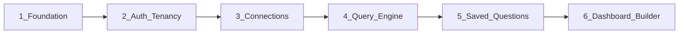

# Dashboardy — Complete Implementation Plan

**Constitution**: [`.specify/memory/constitution.md`](../.specify/memory/constitution.md) v1.2.0  
**Purpose**: Single authoritative implementation plan. Feature work may still be tracked in Spec Kit artifacts per Section 13; this document is the master sequencing and stack contract.

---

## 1. Purpose and non-goals

### 1.1 Purpose

Dashboardy MVP is an **expert-authored, business-consumed** internal BI platform:

- BI/Admin users create connections, author SQL, save questions, and assemble dashboards.
- Viewers and external clients consume dashboards and saved outputs with controlled permissions.
- **Supabase** stores app metadata, auth, and secrets via **Vault**; **Snowflake** is the analytics source of truth.
- The app is **multi-tenant**, **workspace-based**, and **strict on authorization** (enforced in FastAPI; Snowflake remains primary data access control per constitution §6.1).

**Non-negotiable mapping** (constitution §15):

| # | Rule | How this plan satisfies it |
|---|------|---------------------------|
| 1 | Every resource tenant-bound | All tables carry `tenant_id`; API resolves tenant on every request. |
| 2 | Sensitive operations through backend | Backend-only client model; Next.js does not use Supabase DB client for app data. |
| 3 | Snowflake is data access SoT | Connections use least-privilege Snowflake roles; parser + row limits as secondary defense. |
| 4 | Raw SQL constrained | sqlglot pipeline + Snowflake-side SELECT-only role. |
| 5 | Query execution logged | `query_audit_logs` on every execution path (§7.6). |
| 6 | No BI data persistence in app DB | Cache is short-TTL metadata only (§3.2–3.3). |
| 7 | No shared connections across tenants | One connection per tenant (§4.3). |
| 8 | Authors vs consumers | Roles and UI surfaces split per §5. |
| 9 | No silent scope creep | §7 Out-of-MVP list is explicit. |

### 1.2 Non-goals (MVP)

Mirrors constitution **§2 exclusions**: visual query builder, AI insights, scheduled reports, alerts, billing, white-labeling, semantic layer, embedded analytics, comments, version history, public anonymous links, non-Snowflake connectors, XLSX, async export jobs.

---

## 2. Locked decisions

### 2.1 Product and access (this plan + constitution)

| Topic | Decision |
|-------|----------|
| **Client ↔ data** | **Backend-only.** Next.js calls **FastAPI** for all application reads/writes. Supabase provides **Auth** and **Postgres** accessed by the API with service credentials. **No RLS-first architecture**; optional defensive RLS is allowed but **authorization source of truth is FastAPI** (Non-negotiable 2). |
| **Collections** | **Flat only.** One level; each saved question and each dashboard belongs to exactly one **collection** (folder semantics without nesting). |
| **Tenant ↔ workspace (MVP)** | **1:1 enforced in product logic.** Schema retains `tenants` and `workspaces` for future multi-workspace-per-tenant; MVP UI and invariants assume **one workspace per tenant**. |
| **External clients** | **Same Supabase Auth** (email/password). Admin invites by email; membership role `external_client` per workspace. **Per-asset grants only** for what they see (§2.1, §6.0). |
| **Widget types (MVP)** | **KPI (scalar), bar, line, table** only. Pie, area, scatter, funnel **deferred** (narrower than §3.3 list; not a scope expansion). |

### 2.2 Stack (locked for implementation)

| Layer | Choice |
|-------|--------|
| **Monorepo** | **pnpm** workspaces + **Turborepo**; layout per constitution **§12**: `apps/web`, `apps/api`, `packages/ui`, `packages/types`, `packages/config`. |
| **Web** | Next.js **14.x**, **App Router**, TypeScript, **TanStack Query**, **Zustand** (local UI), **Tailwind** + **shadcn/ui**, **Monaco** (SQL), **Recharts** (charts), **`@supabase/ssr`** for **session/auth only** (no PostgREST data client for app tables in MVP). |
| **API** | **FastAPI**, Python **3.12**, **`uv`**, Pydantic v2, **`snowflake-connector-python`**, **`sqlglot`** (Snowflake dialect) for parse/validate, **SQLAlchemy 2.x** + **asyncpg** to Supabase Postgres, **Alembic** migrations. |
| **Tests** | **pytest** + pytest-asyncio (API), **Playwright** (web smoke), **Vitest** (unit). |
| **Observability** | Structured **JSON** logs, **request/trace IDs**; Sentry optional later. |
| **Deploy** | **Docker** per app; **GitHub Actions** build/push on tag; **Bunny Magic Containers**; **`migrate` one-shot** runs `alembic upgrade head` **before** API rollout (failure blocks deploy). |
| **Result cache** | **Postgres table** `cache_entries` in Supabase; **TTL sweeper** (cron or API-side periodic task). |

### 2.3 Backend package layout (8 domains)

Consolidates the ChatGPT 13-module split:

1. **`auth_context`** — JWT verification (Supabase JWT), user id extraction, request correlation IDs.
2. **`tenancy`** — tenants, workspaces, memberships, role on membership, tenant/workspace resolution, **central permission service** (collection / question / dashboard / external grant checks).
3. **`connections`** — metadata CRUD, Vault secret refs, test/rotate, effective connection resolution, **≤60s** cache invalidation on rotation (§10.2).
4. **`query_engine`** — parser, parameter binding validation, queue, Snowflake execution, row limits, timeouts, **cache read/write** with permission re-check, **audit writes**.
5. **`questions`** — saved questions, collections, lifecycle, clone, list/detail, **sync CSV export** caps (§7.4).
6. **`dashboards`** — dashboards, widgets, layouts, global filters, per-widget overrides, orchestration, clone.
7. **`admin`** — member invites, role changes, **external-client grants** to specific assets only.
8. **`system`** — health/readiness, diagnostics, normalized errors catalog exposure.

**Do not** duplicate permission logic across route handlers; **tenancy** module owns it.

---

## 3. Dependency and build order

Authoritative order (constitution **§13**, **§14.1**):

No skipping. Deviations require constitution **§17** compliance review.

---

## 4. Features (implementation phases)

Each feature lists **schema delta**, **API contract sketch**, **frontend surface**, **tests**, **exit criteria**.

Conventions:

- All tenant-scoped tables include `tenant_id` (UUID).
- MVP: `workspaces.tenant_id` is **unique** where enforced in app (one workspace per tenant); nullable future multi-workspace left to schema comments only.
- **Soft delete** where useful: `deleted_at` on authorable assets.
- **No `export_jobs` table** — exports are synchronous HTTP responses only.

---

### Feature 1 — Foundation / platform baseline

**Goal**: Deployable skeleton, CI/CD, env contract, migrations, health, logging.

#### Schema delta

- Minimal or empty beyond Alembic version table until Feature 2; optional `schema_migrations` is Alembic-managed.

#### Backend

- FastAPI app: lifespan, CORS (web origin only), exception handlers → normalized error envelope.
- Endpoints: `GET /health`, `GET /ready` (DB connectivity check).
- Settings from env (`packages/config` shared types for names only; secrets never in repo).

#### Frontend

- Next.js app shell: layout, placeholder home, env-based API base URL.

#### Infra

- `Dockerfile` for `apps/web`, `apps/api`.
- GitHub Actions: lint/test matrix; build images; on release tag deploy Bunny; **migrate job** first.

#### Tests

- API: health/ready return 200 when DB mocked or test DB up.
- Smoke: Playwright “app loads”.

#### Exit criteria

- Staging deploy: web + API containers healthy; **migrations run** in pipeline; **environment variable contract** documented in this file’s appendix or `packages/config` README.

**Non-negotiables**: 2 (no secrets in client), 9 (no extra scope).

---

### Feature 2 — Auth + tenancy

**Goal**: Every downstream request resolves **`user_id`**, **`tenant_id`**, **`workspace_id`**, **`role`** (analyst | admin | viewer | external_client). **No exceptions** for tenant-scoped routes.

#### Schema delta

| Table | Purpose |
|-------|---------|
| `tenants` | `id`, `name`, `created_at`, … |
| `workspaces` | `id`, `tenant_id` (FK, **unique in MVP** enforcement in app), `name`, `slug`, timestamps |
| `memberships` | `id`, `user_id` (Supabase `auth.users.id`), `workspace_id`, **`role`** enum, `created_at`; unique `(user_id, workspace_id)` |
| `collection_grants` | Internal sharing at collection level: `collection_id`, `membership_id` or `user_id` + `workspace_id` (pick one consistent model: **prefer `membership_id`** for internal grants) |
| `asset_grants` (optional split) | **External client** explicit grants: `workspace_id`, `user_id` (external), `asset_type` (question|dashboard), `asset_id`, `can_export` (bool, default false per §5.4) |

**Removed from ChatGPT draft**: separate `workspace_role_assignments` — **role lives on `memberships`**.

**RLS**: Optional deny-all for direct anon access; **API uses service role** and enforces auth in code.

#### Backend

- Middleware: verify Supabase JWT (JWKS), attach `user_id`.
- Dependency chain: resolve default workspace for user (MVP: the single workspace for their tenant); load membership → `role`.
- **Permission service** (skeleton): `can(user, action, resource)` returning bool + `authz_denied` reason code.

#### API sketch

- `GET /me` — user + workspaces + roles (MVP: one workspace).
- `POST /workspaces/switch` — no-op or future-proof stub if only one workspace (optional).
- Admin: `GET/POST/PATCH /workspaces/{id}/members` (invite flow coordinates Supabase Admin API for user creation invite).

#### Frontend

- Sign-in / sign-out (`@supabase/ssr`).
- Session restore; protected layout wrapper calling `GET /me`.
- Workspace switcher: **minimal** in MVP (single workspace — show name, hide switcher or disable).

#### External client auth flow (locked)

1. Admin enters external user email in **Members** UI.
2. Backend creates or invites user via **Supabase Admin** (same Auth project).
3. User sets password via Supabase email flow.
4. Admin assigns role **`external_client`** on membership.
5. Admin creates **`asset_grants`** rows for specific dashboard/question IDs only.
6. API **never** returns SQL or connection metadata to `external_client` (§2.1).

#### Tests

- JWT missing → 401.
- Valid JWT, no membership → 403 or empty tenant resolution policy (document: **403**).
- Role-gated stub route: viewer cannot hit admin-only path.

#### Exit criteria

- Authenticated user; **tenant-bound** responses; backend rejects unauthorized access; membership + role authoritative.

**Non-negotiables**: 1, 2, 8.

---

### Feature 3 — Data connections + credentials

**Goal**: **One Snowflake connection per tenant** (§4.3); credentials **only in Vault** (§10); admin-only management (§5.1).

#### Schema delta

| Table | Purpose |
|-------|---------|
| `data_connections` | `id`, `tenant_id` (**unique**), `name`, `vault_secret_id` (opaque ref), `warehouse`, `database`, `schema` (optional display), `status`, `last_tested_at`, `last_error` (sanitized), timestamps |

No plaintext secrets in columns.

#### Backend

- Vault: create/update secret via Supabase Vault API from service role; store **reference id** only on `data_connections`.
- **Connection cache** in process: keyed by `tenant_id` / `connection_id`; **invalidate all holders within 60s** of secret rotation (§10.2).
- Endpoints (admin only): create, update, rotate secret, test, get **metadata** (no secret fields).

#### Frontend

- Admin **Connections** page: form (no echo of password after submit), test button, status badge, rotate flow.

#### Tests

- Non-admin → `authz_denied`.
- Rotation: simulate Vault update → new executions use new creds within 60s window under test clock or counter.

#### Exit criteria

- One connection per tenant enforced; test connection works; secrets never in API JSON or logs.

**Non-negotiables**: 2, 3, 7.

---

### Feature 4 — Query engine

**Goal**: Safe, observable, bounded execution with **parser**, **queue**, **audit**, **cache** (§7, §8.2, §3.3).

#### Schema delta

| Table | Purpose |
|-------|---------|
| `query_audit_logs` | **Exactly** §7.6 fields: `id`, `tenant_id`, `workspace_id`, `user_id`, `connection_id`, `saved_question_id` (nullable), `dashboard_id` (nullable), `sql_hash`, `bound_parameters_hash`, `row_count`, `bytes_scanned` (nullable), `duration_ms`, `cache_hit`, `status`, `error_code` (nullable), `created_at`. Optional separate **`query_debug_sql`** admin-only table for raw SQL — never log secrets. |
| `cache_entries` | `id`, `tenant_id`, `connection_id`, `cache_key` (deterministic string or hash), `payload` (JSON compressed or bytea), `expires_at`, `created_at`, `widget_type` (for TTL class), indexes on `(tenant_id, cache_key)`, `expires_at` |

**Retention**: audit ≥ **90 days** (§7.6) — implement via scheduled prune of older rows or partition policy.

#### Parser (sqlglot) — rejection rules (testable)

Use **sqlglot** `parse_one(..., dialect="snowflake")` then AST checks:

1. **Single statement** — reject if multiple statements / multiple roots.
2. **Top-level statement type** — allow only `SELECT` or `WITH` leading to `SELECT`; reject `INSERT`, `UPDATE`, `DELETE`, `MERGE`, `CREATE`, `DROP`, `ALTER`, `TRUNCATE`, `GRANT`, `CALL`, `EXECUTE`, `COPY`, `PUT`, `GET`, etc.
3. **No session / context mutation** — reject if AST contains commands or patterns mapping to: `USE WAREHOUSE`, `USE DATABASE`, `USE SCHEMA`, `USE ROLE`, `SET`, transaction controls, or connection/session-altering constructs (maintain explicit denylist tested with golden SQL files).
4. **No multi-statement** — no `;` separated second executable tree.
5. **Identifiers** — if dynamic identifiers ever supported, **allowlist from saved question definition only** (§7.5); MVP can reject all non-literal dynamic identifiers in ad hoc path.

Normalized SQL for hashing: sqlglot **canonicalize** (stable format) then hash (e.g. SHA-256).

#### Execution pipeline (ordered)

1. Authenticate → resolve `tenant_id`, `workspace_id`, `role`.
2. Authorize action (ad hoc vs saved vs widget — different checks in Feature 5–6; engine receives **resolved** permission flag).
3. Resolve `data_connections` for tenant; obtain creds from Vault (service).
4. Parse + reject → `rejected_by_parser` if fail.
5. Validate **bound parameters**: every filter/value must map to declared parameters; **no string concat** of user values (§7.5); hash parameter names + **sorted** stable representation for audit (`bound_parameters_hash`); **do not log raw PII values** (§7.6).
6. Compute `sql_hash` from normalized SQL.
7. If cache eligible (see §3.3): lookup `cache_entries` by tenant-scoped key; on hit **re-run permission check**; if fail, treat as miss.
8. Acquire **queue slot** (below); on timeout waiting → `warehouse_busy`.
9. Execute on Snowflake with **30s** timeout (§7.4), **row limit** enforcement; capture `bytes_scanned` if driver exposes.
10. Write **audit** row always (§7.6); populate `cache_hit`.
11. Return normalized response + `status` (`ok` | `timeout` | `row_limit_exceeded` | `rejected_by_parser` | `warehouse_error` | `authz_denied`).

**Ad hoc SQL**: **no caching** (§3.3). **Saved question / widget**: cache allowed per TTL class.

#### Queueing (locked for MVP baseline §8.2)

- **`asyncio.Semaphore(10)`** — max concurrent Snowflake executions **per API instance**.
- **`asyncio.Queue(maxsize=N)`** (choose N e.g. 50) for waiting requests; each waits **bounded wall time** (e.g. 25s); if acquired before Snowflake timeout, proceed; if queue full or wait exceeded → respond with typed **`warehouse_busy`** (not generic 500).
- **Multi-instance**: document that effective concurrency = **10 × instance count** until Redis-backed queue is introduced (post-MVP scaling note).

#### Cache eligibility and TTL (§3.3)

| Execution kind | Cache |
|----------------|-------|
| Ad hoc SQL | **Never** |
| Saved question execute | Yes, TTL by widget type when executed **as widget**; saved question **detail run** may use **chart TTL** if bar/line, **KPI TTL** if scalar endpoint — document in API |
| Widget | Yes |

**TTL classes** (ceiling **15 minutes**):

- **KPI / scalar** widget: **10 minutes**
- **Bar / line** (chart class): **5 minutes**
- **Table**: **2 minutes**

**Workspace MAY lower TTL** per widget in dashboard JSON (never raise above class default ceiling of 15m) — store effective TTL on widget config.

**Cache key composition** (must include all of): `tenant_id`, `connection_id` (or vault ref version bump on rotation), `sql_hash`, `bound_parameters_hash`, `saved_question_id` or explicit ad hoc marker, `dashboard_id`+`widget_id` when widget-scoped, **filter state hash** for global + resolved overrides per §7.7.

**Invalidation triggers** (must purge or delete keys):

- Saved question **SQL text** or **parameter definition** change.
- **Connection** rotation / material change to Vault ref.
- Widget **filter mapping** or **filter default** change in dashboard definition.
- User invokes **bypass cache** flag on execute request.

#### API sketch

- `POST /query/execute` — body: mode (`adhoc` | `saved_question` | `widget`), sql or ids, `parameters`, `bypass_cache`.
- Returns: columns, rows (capped), `status`, `error_code`, `meta` (duration, row_count, truncated flag).

#### Frontend

- Minimal **Run** page for internal testing only until Feature 5–6; or stub in Storybook.

#### Tests

- Golden file tests for parser allow/deny.
- Concurrency tests: 11th simultaneous request queues or busy.
- Cache: key includes tenant; permission change invalidates access; bypass works.

#### Exit criteria

- Parser rejects forbidden SQL; audit row on every path; queue + `warehouse_busy` typed; cache obeys §3.3.

**Non-negotiables**: 3, 4, 5, 6.

---

### Feature 5 — Saved questions + collections

**Goal**: Reusable questions, **flat collections**, inheritance + explicit widens only (§6.0), clone behavior (§5.2), sync CSV export with caps (§7.4).

#### Schema delta

| Table | Purpose |
|-------|---------|
| `collections` | `id`, `workspace_id`, `tenant_id`, `name`, `slug`, ordering, `deleted_at` |
| `collection_memberships` (internal ACL) | Which **memberships** can see/edit collection (or simplify: grants table from Feature 2 extended for `collection_id`) |
| `saved_questions` | `id`, `tenant_id`, `workspace_id`, `collection_id`, `title`, `description`, `sql_text`, **`parameter_schema`** (JSON: name, type, required), `created_by`, timestamps, `deleted_at` |
| `question_grants` | Optional per-question **widen** beyond collection (membership_id + permission level) |

**Inheritance**: question effective ACL = collection ACL ∪ explicit `question_grants`. **No deny** (§6.0).

**Clone** (§5.2): new question owned by cloning analyst; **permissions = target collection’s**, not source’s.

#### Backend

- CRUD + list filtered by permission service.
- Execute: delegates to `query_engine` with `saved_question_id`, parameters, no cache bypass unless requested.
- **CSV export**: same execution path, row cap **hard max 10,000** (§7.4), stream response; **permission check**; external clients only if grant `can_export`.

#### API sketch

- `GET/POST /collections`, `GET/PATCH/DELETE /collections/{id}`
- `GET/POST /questions`, `GET/PATCH/DELETE /questions/{id}`, `POST /questions/{id}/clone`, `POST /questions/{id}/execute`, `GET /questions/{id}/export.csv`

#### Frontend

- Collections list, question list, editor (Monaco), parameter editor (JSON form or UI), run & results table, save, clone, export.

#### Tests

- Viewer cannot PATCH question; analyst can clone into permitted collection; export 403 for external without grant.

#### Exit criteria

- Full authoring loop for analyst; viewer read-only where granted; CSV obeys limits.

**Non-negotiables**: 1, 2, 8.

---

### Feature 6 — Dashboard builder

**Goal**: Assemble widgets from saved questions; **global filters** + **per-widget overrides** visible in UI (§7.7); sharing; viewer/external consumption without SQL exposure.

#### Schema delta

| Table | Purpose |
|-------|---------|
| `dashboards` | `id`, `tenant_id`, `workspace_id`, `collection_id`, `title`, `definition` (JSON: layout, filters, widget list), `created_by`, timestamps, `deleted_at` |
| `dashboard_widgets` | Optional normalization: `id`, `dashboard_id`, `type` (`kpi`|`bar`|`line`|`table`), `saved_question_id`, `layout`, `config` (chart options, TTL override lower-bound), **`filter_overrides`** JSON, **`filter_bindings`** JSON (maps global filter id → parameter name) |
| `dashboard_grants` | Per-dashboard widen; external explicit grants may reference dashboard id in `asset_grants` from Feature 2 |

**Filter rules** (§7.7) encoded in `definition`:

- Global filters: id, bound parameter mapping target, default value (**not** user-derived).
- Widget: `filter_bindings` must declare mapping for each global filter it respects; **no silent bind**.
- Overrides **must** be rendered in widget chrome (frontend contract).

**Table widget** (§7.4): server returns up to hard row limit; **client-side pagination** only.

#### Backend

- Dashboard CRUD; widget CRUD; clone dashboard (new owner, permissions per §5.2).
- `POST /dashboards/{id}/execute` or per-widget `POST /widgets/{id}/execute` with merged filter state → `query_engine` with `dashboard_id`, widget scope.

#### Frontend

- Dashboard list, builder (grid), add widget, pick question, chart type (KPI/bar/line/table), filter bar, override indicators, viewer layout.

#### Tests

- E2E: filter change changes cache key (no stale cross-filter data); external client never receives `sql_text`.

#### Exit criteria

- Analyst builds dashboard; viewer consumes; external client only sees granted assets; filters behave per §7.7.

**Non-negotiables**: 1, 2, 8.

---

## 5. Cross-cutting concerns

### 5.1 Audit (§7.6)

Every execution writes one row to `query_audit_logs` with statuses from glossary below. Raw SQL storage optional and **admin-only**, separate from main audit row if stored.

### 5.2 Cache (§3.3)

- Postgres-backed `cache_entries`; background job deletes `expires_at < now()`.
- Permission re-check on read mandatory.

### 5.3 Secrets (§10)

- Never return secret fields; never log; rotation without redeploy; 60s propagation requirement.

### 5.4 Migrations (§11.3)

- Alembic revision per feature or per logical migration; **staging first**, then production; forward-fix documented when downgrades unsafe.

### 5.5 Performance targets (§8.1)

Document as SLOs in runbooks; validate in hardening phase.

### 5.6 Normalized errors

API returns stable `error_code` + HTTP status mapping document (401/403/409/429/503 with typed body for queue).

---

## 6. Risk register

| Risk | Mitigation |
|------|------------|
| **SQL parser gaps** | sqlglot + golden tests + Snowflake **SELECT-only** role (primary defense §7.5). |
| **Permission drift** | Single **permission service** in `tenancy`; inheritance rules documented in this plan; code review checklist. |
| **Cache wrong-data / leakage** | Key includes tenant + connection + sql + params + widget/dashboard scope; permission on read; force refresh. |
| **Frontend ahead of API** | This plan sequences features; OpenAPI published from FastAPI; web uses generated types where feasible. |
| **Snowflake cost** | Row caps, timeout, audit, cache, discourage heavy ad hoc in prod workspaces (§8.3). |

---

## 7. Out-of-MVP (explicit)

See **§1.2** and constitution **§2**. Do not implement without amendment + spec.

---

## 8. Glossary — `status` and errors (§7.6)

| `status` / concept | Meaning |
|--------------------|---------|
| `ok` | Completed within limits. |
| `timeout` | Exceeded execution timeout (~30s). |
| `row_limit_exceeded` | Result beyond allowed cap; user must narrow query. |
| `rejected_by_parser` | Failed AST / policy checks. |
| `warehouse_error` | Snowflake/driver error after dispatch. |
| `authz_denied` | Failed permission check. |
| `warehouse_busy` | Queue saturated or wait bound exceeded (§8.2). |
| `error_code` | Nullable normalized sub-code for UI/analytics. |

---

## 9. Appendix — Environment variable contract (names only)

Document in repo README when implemented; typical keys:

- `DATABASE_URL` (Supabase Postgres, API service)
- `SUPABASE_URL`, `SUPABASE_SERVICE_ROLE_KEY`, `SUPABASE_JWT_SECRET` or JWKS URL
- `SNOWFLAKE_*` (never on client)
- `API_PUBLIC_URL`, `WEB_PUBLIC_URL`
- `LOG_LEVEL`, `ENVIRONMENT` (`staging`|`production`)

---

## 10. Constitution compliance checklist

- [ ] §13 feature order followed  
- [ ] §3.3 cache rules implemented  
- [ ] §7.4 limits and table pagination behavior  
- [ ] §7.5 parser + parameter binding  
- [ ] §7.6 audit schema  
- [ ] §7.7 filters and overrides visibility  
- [ ] §8.2 queue semantics  
- [ ] §10 Vault + rotation  
- [ ] §11 deployment + migrations  

**Version**: 1.0 (implementation plan) | **Aligned to constitution**: 1.2.0
