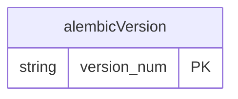

# Data Model: Platform Foundation

**Feature**: 001-platform-foundation  
**Date**: 2026-04-17

## Status

**Phase 1 introduces no domain entities.** The feature spec ([spec.md](spec.md), Key Entities section) explicitly states "Not applicable to this phase. The foundation introduces no domain entities; domain data begins in the next phase (identity and tenancy)."

This document exists to make that explicit, capture the **substrate-only** schema artifacts that *are* created in Phase 1, and lock the conventions that Phase 2 onward will inherit.

## Substrate schema (created this phase)

| Object | Owner | Purpose |
|--------|-------|---------|
| `alembic_version` (table, single row, single column) | Alembic | Tracks the currently applied migration revision so `alembic upgrade head` is idempotent (US2 acceptance scenario 3, FR-013). |
| `0001_baseline` (Alembic revision) | This feature | A no-op revision that establishes the migration chain. Adds no domain tables. Its existence proves the pipeline end-to-end against staging. |

There are no other tables in this phase. No domain table, no `tenants`, no `users`, no `sessions`, no `cache_entries`. Those arrive in Feature 2 (auth + tenancy) and Feature 4 (query engine) respectively.

## Reserved conventions (forward-compatibility)

These are not implemented in Phase 1, but are **locked here** so Phase 2 onward does not need to retrofit them. Every domain table created from Feature 2 onward MUST conform.

### Naming

- Snake-case, plural for tables (`tenants`, `workspaces`, `memberships`, `data_connections`, `saved_questions`, `dashboards`, `dashboard_widgets`, `query_audit_logs`, `cache_entries`).
- `id` is the primary key on every table; type **UUID** (Postgres `uuid` with `gen_random_uuid()` default via `pgcrypto`).
- Foreign keys end in `_id` and reference the parent table's `id`.
- Timestamp columns: `created_at TIMESTAMPTZ NOT NULL DEFAULT now()` and `updated_at TIMESTAMPTZ NOT NULL DEFAULT now()` on every mutable table; `updated_at` maintained by an `BEFORE UPDATE` trigger or by application code.
- Soft-delete on authorable assets (saved questions, dashboards, collections): nullable `deleted_at TIMESTAMPTZ`. Hard delete is reserved for admin-only paths.

### Tenant scoping (Non-Negotiable 1)

- Every domain table created from Feature 2 onward MUST carry `tenant_id UUID NOT NULL REFERENCES tenants(id)`.
- All non-trivial indexes MUST be prefixed by `tenant_id` (e.g., `(tenant_id, workspace_id, created_at)`).
- The application MUST always include `tenant_id` in `WHERE` clauses; helpers in the API's `tenancy` module will enforce this so route handlers cannot forget.

### Workspace scoping

- Domain tables that have workspace meaning MUST carry `workspace_id UUID NOT NULL REFERENCES workspaces(id)`.
- MVP enforces 1:1 tenant↔workspace in product logic (locked in [docs/implementation-plan.md](../../docs/implementation-plan.md) §2.1).

### Audit, cache, and other reserved table shapes

The exact column lists are **specified in the constitution** and the master plan; they are **not** created in Phase 1, but are pinned here as future schema:

- `query_audit_logs` — full schema in constitution §7.6 and [docs/implementation-plan.md](../../docs/implementation-plan.md) Feature 4.
- `cache_entries` — schema in [docs/implementation-plan.md](../../docs/implementation-plan.md) Feature 4; TTL classes per constitution §3.3.
- `data_connections`, `tenants`, `workspaces`, `memberships`, `collections`, `saved_questions`, `dashboards`, `dashboard_widgets`, `asset_grants` — schemas in [docs/implementation-plan.md](../../docs/implementation-plan.md) Features 2/3/5/6.

### Migration discipline (constitution §11.3)

- Every schema change goes through a versioned, committed Alembic revision under `apps/api/app/db/migrations/versions/`.
- Migrations apply identically to staging and production. Ad-hoc schema edits via the Supabase UI in production are forbidden outside incident response and MUST be back-ported to a migration within the same working day.
- Each migration MUST be reversible (provide a working `downgrade()`), OR the release artifact MUST include a documented forward-fix plan stored alongside the migration file (e.g., a sibling `0042_add_index.forward-fix.md`).

## State transitions

None this phase — there are no domain entities.

## Validation rules from requirements

The only validation in Phase 1 is at the **configuration boundary** (FR-010, R-011), not at a data-model boundary:

- Required environment variables MUST be present and non-empty at startup; otherwise the container exits with a message naming the missing variable.

## Diagram

A single bookkeeping table. Domain entities arrive in Feature 2.
