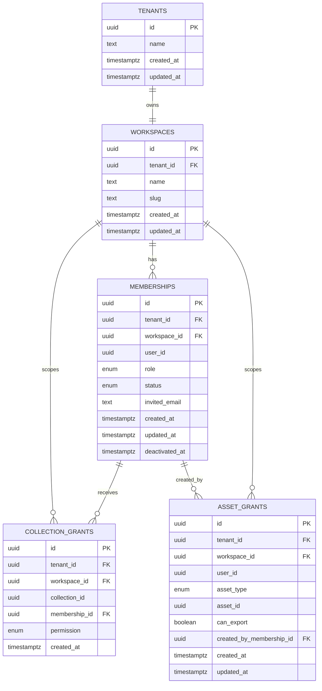

# Data Model: Auth + Tenancy

**Feature**: 002-auth-tenancy  
**Date**: 2026-04-27

## Status

Feature 2 introduces the first domain metadata tables: tenants, workspaces, memberships, internal collection grants, and external asset grants. These tables establish tenant/workspace context and role-based permission inputs for all later features.

All schema changes must be implemented as committed Alembic revisions under `apps/api/app/db/migrations/versions/`.

## Entities

### Tenant

Represents a customer or organization boundary.

| Field | Type | Required | Notes |
|-------|------|----------|-------|
| `id` | UUID | yes | Primary key, generated by database |
| `name` | text | yes | Human-readable organization name |
| `created_at` | timestamp | yes | Creation time |
| `updated_at` | timestamp | yes | Last metadata update |

**Relationships**:

- One tenant has one workspace in MVP.
- Every workspace belongs to one tenant.

**Validation rules**:

- Name must be non-empty after trimming.
- Tenant records are operator pre-provisioned in MVP.

### Workspace

Represents the working area inside a tenant.

| Field | Type | Required | Notes |
|-------|------|----------|-------|
| `id` | UUID | yes | Primary key |
| `tenant_id` | UUID | yes | References `tenants.id` |
| `name` | text | yes | Display name |
| `slug` | text | yes | Stable human-readable identifier within the tenant |
| `created_at` | timestamp | yes | Creation time |
| `updated_at` | timestamp | yes | Last metadata update |

**Relationships**:

- One workspace belongs to one tenant.
- One workspace has many memberships.
- One workspace has many grants.

**Validation rules**:

- `tenant_id` is unique for MVP to enforce one workspace per tenant.
- `(tenant_id, slug)` is unique.
- Name and slug must be non-empty.
- Workspace records are operator pre-provisioned in MVP.

### Membership

Connects an authenticated user identity to a workspace with one authoritative role and active/inactive status.

| Field | Type | Required | Notes |
|-------|------|----------|-------|
| `id` | UUID | yes | Primary key |
| `tenant_id` | UUID | yes | References `tenants.id`; denormalized for tenant-bound querying |
| `workspace_id` | UUID | yes | References `workspaces.id` |
| `user_id` | UUID | yes | Supabase Auth user ID |
| `role` | enum | yes | `admin`, `analyst`, `viewer`, `external_client` |
| `status` | enum | yes | `active`, `inactive` |
| `invited_email` | text | no | Email used for invitation when available |
| `created_at` | timestamp | yes | Creation time |
| `updated_at` | timestamp | yes | Last metadata update |
| `deactivated_at` | timestamp | no | Set when access is removed |

**Relationships**:

- One membership belongs to one workspace and tenant.
- Internal collection grants should target memberships.
- Later authored content may reference membership/user as creator or owner.

**Validation rules**:

- `(user_id, workspace_id)` is unique.
- `role` must be one of the four MVP roles.
- `status` defaults to `active`.
- Inactive memberships cannot authorize protected tenant-scoped access.
- First admin memberships are operator pre-provisioned in MVP.

**State transitions**:

```text
active --admin deactivates--> inactive
inactive --admin reactivates, if supported by implementation task--> active
```

If reactivation is implemented, historical `deactivated_at` may remain as an audit hint or be paired with future audit events. Reactivation is not required for the MVP acceptance criteria unless tasks explicitly include it.

### Collection Grant

Represents internal collection-level sharing for workspace members. The referenced collection table arrives in Feature 5, but Feature 2 reserves the grant shape so the permission service can be designed around it.

| Field | Type | Required | Notes |
|-------|------|----------|-------|
| `id` | UUID | yes | Primary key |
| `tenant_id` | UUID | yes | References `tenants.id` |
| `workspace_id` | UUID | yes | References `workspaces.id` |
| `collection_id` | UUID | yes | Future `collections.id` |
| `membership_id` | UUID | yes | References `memberships.id` |
| `permission` | enum | yes | `read`, `write`, `admin` |
| `created_at` | timestamp | yes | Creation time |

**Relationships**:

- One grant belongs to one tenant/workspace.
- One grant applies to one active or historical membership.

**Validation rules**:

- `(collection_id, membership_id)` is unique.
- The membership must belong to the same tenant and workspace as the grant.
- External-client membership roles must not receive access through collection grants.

### Asset Grant

Represents explicit external-client access to a specific saved question or dashboard.

| Field | Type | Required | Notes |
|-------|------|----------|-------|
| `id` | UUID | yes | Primary key |
| `tenant_id` | UUID | yes | References `tenants.id` |
| `workspace_id` | UUID | yes | References `workspaces.id` |
| `user_id` | UUID | yes | Supabase Auth user ID for external client |
| `asset_type` | enum | yes | `question`, `dashboard` |
| `asset_id` | UUID | yes | Future saved question or dashboard ID |
| `can_export` | boolean | yes | Defaults to `false` |
| `created_by_membership_id` | UUID | yes | Admin membership that created the grant |
| `created_at` | timestamp | yes | Creation time |
| `updated_at` | timestamp | yes | Last metadata update |

**Relationships**:

- One grant belongs to one tenant/workspace.
- One external user can have many asset grants.
- The creating membership must be an active admin membership.

**Validation rules**:

- `(workspace_id, user_id, asset_type, asset_id)` is unique.
- `can_export` defaults to `false`.
- Only external-client users should be authorized through this grant path.
- Grant lookup must also verify the external client has an active membership in the workspace.

## Permission Decision Inputs

The permission service consumes:

- authenticated `user_id`
- resolved `tenant_id`
- resolved `workspace_id`
- membership `role`
- membership `status`
- target resource type and ID, when applicable
- collection grants for internal users
- asset grants for external clients

The decision output is:

- `allowed`: boolean
- `reason`: machine-readable deny reason when not allowed, such as `missing_token`, `invalid_token`, `no_membership`, `inactive_membership`, `role_not_allowed`, `grant_required`, or `tenant_mismatch`

Mapping note (internal → public API response `error_code`):

- `missing_token`, `invalid_token` → `auth_required`
- `no_membership` → `no_membership`
- `inactive_membership` → `inactive_membership`
- `role_not_allowed`, `grant_required`, `tenant_mismatch` → `authz_denied`

## Validation Rules From Requirements

- Missing/invalid JWT results in authentication failure before tenant data is returned.
- Valid JWT with no active membership results in authorization denial before tenant data is returned.
- Non-admin memberships cannot invite members, change roles, deactivate memberships, or create external asset grants.
- Admin role is required for member management and external grant management.
- External clients can read only explicit asset grants and never receive SQL text or connection metadata.
- Workspace switch is a no-op/stub while a tenant has only one workspace.

## Migration Notes

- Migration should create enum types or equivalent check constraints for `membership_role`, `membership_status`, `collection_permission`, and `asset_type`.
- Foreign keys should be explicit and tenant-aware indexes should be present on all lookup paths.
- Suggested indexes:
  - `workspaces(tenant_id)`
  - `memberships(tenant_id, workspace_id, user_id)`
  - `memberships(user_id, status)`
  - `collection_grants(tenant_id, workspace_id, collection_id)`
  - `asset_grants(tenant_id, workspace_id, user_id, asset_type, asset_id)`
- Optional defensive RLS may deny direct anonymous access, but FastAPI remains the authorization source of truth.

## Diagram


