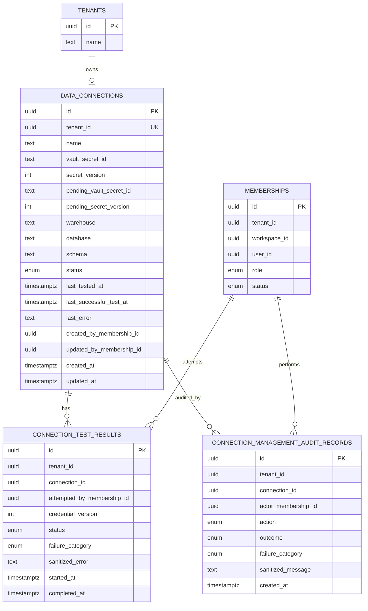

# Data Model: Data Connections + Credentials

**Feature**: 003-data-connections  
**Date**: 2026-04-29

## Status

Feature 3 introduces tenant-bound Snowflake connection metadata, secret references, connection test history, and security audit records for admin connection management.

All schema changes must be implemented as committed Alembic revisions under `apps/api/app/db/migrations/versions/`.

## Entities

### Data Connection

Represents the tenant's single approved Snowflake connection configuration.

| Field | Type | Required | Notes |
|-------|------|----------|-------|
| `id` | UUID | yes | Primary key |
| `tenant_id` | UUID | yes | References `tenants.id`; unique in MVP |
| `name` | text | yes | Admin-facing display name |
| `vault_secret_id` | text | no | Opaque Supabase Vault reference for the effective credential; null while `not_configured` |
| `secret_version` | integer | yes | Monotonic effective credential version for cache-holder invalidation after successful rotation |
| `pending_vault_secret_id` | text | no | Opaque Supabase Vault reference for submitted credentials awaiting a successful test |
| `pending_secret_version` | integer | no | Version being tested before activation |
| `warehouse` | text | yes | Snowflake warehouse label |
| `database` | text | yes | Snowflake database label |
| `schema` | text | no | Optional default schema label for display/connection context |
| `status` | enum | yes | `not_configured`, `pending_test`, `active`, `test_failed` |
| `last_tested_at` | timestamp | no | Time of most recent connection test attempt |
| `last_successful_test_at` | timestamp | no | Time of most recent successful test |
| `last_error` | text | no | Sanitized admin-facing error summary |
| `created_by_membership_id` | UUID | yes | Admin membership that created the record |
| `updated_by_membership_id` | UUID | no | Admin membership that last changed metadata or credentials |
| `created_at` | timestamp | yes | Creation time |
| `updated_at` | timestamp | yes | Last metadata/status update |

**Relationships**:

- One tenant has zero or one data connection before setup and exactly one active connection after successful setup.
- A data connection belongs to one tenant and must never be shared across tenants.
- A data connection has many connection test results and many management audit records.

**Validation rules**:

- `tenant_id` is unique for MVP.
- Only active admin memberships in the same tenant/workspace may create, update, test, or rotate.
- `name`, `warehouse`, and `database` must be non-empty after trimming.
- `vault_secret_id` and `pending_vault_secret_id` must never be returned to frontend clients unless represented as non-sensitive boolean/reference presence indicators in API responses.
- `last_error` must be sanitized and must not contain credential values.
- Delete and disable are not supported in MVP.

**State transitions**:

```text
not_configured --admin submits credentials--> pending_test
pending_test --test succeeds--> active
pending_test --test fails--> test_failed
active --admin submits rotated credentials--> pending_test
pending_test --rotation test succeeds--> active
pending_test --rotation test fails--> test_failed, previous active credential remains effective
test_failed --admin resubmits credentials--> pending_test
```

For a failed rotation from `active`, the visible status may show `test_failed` while `vault_secret_id` remains the effective credential for downstream access and `pending_vault_secret_id` identifies the failed pending credential until replaced or cleared.

### Credential Secret

Represents sensitive Snowflake credential material stored in Supabase Vault.

| Field | Type | Required | Notes |
|-------|------|----------|-------|
| `vault_secret_id` | text | yes | Opaque reference returned by Supabase Vault |
| `tenant_id` | UUID | yes | Included in secret naming/metadata if supported by Vault integration |
| `connection_id` | UUID | yes | Associated data connection |
| `created_at` | timestamp | yes | Secret creation time, if available from Vault |
| `version` | integer | yes | Mirrors or maps to `data_connections.secret_version` |

**Relationships**:

- One data connection references the currently effective credential secret.
- Pending credential material must not replace the effective reference until its test succeeds.

**Validation rules**:

- Plaintext secret values are accepted only during create or rotate requests.
- Plaintext secret values must never be stored in app tables, returned in responses, logged, or included in audit records.
- Credentials must be readable only by the backend service role.

### Connection Test Result

Represents the outcome of an admin-triggered connection validation attempt.

| Field | Type | Required | Notes |
|-------|------|----------|-------|
| `id` | UUID | yes | Primary key |
| `tenant_id` | UUID | yes | References `tenants.id` |
| `connection_id` | UUID | yes | References `data_connections.id` |
| `attempted_by_membership_id` | UUID | yes | Admin membership that ran the test |
| `credential_version` | integer | yes | Version being tested |
| `status` | enum | yes | `success` or `failure` |
| `failure_category` | enum | no | `credential`, `network`, `permission`, `timeout`, `unknown` |
| `sanitized_error` | text | no | Safe admin-facing error summary |
| `started_at` | timestamp | yes | Test start time |
| `completed_at` | timestamp | yes | Test completion time |

**Relationships**:

- One data connection has many test results.
- The latest test result updates `data_connections.status`, `last_tested_at`, `last_successful_test_at`, and `last_error`.

**Validation rules**:

- Test results must not store plaintext credentials.
- Failure category should be populated for failed tests when the underlying cause can be classified.
- Tests must be bounded so a connection test cannot hang indefinitely.

### Connection Management Audit Record

Represents a security audit event for an admin connection management attempt.

| Field | Type | Required | Notes |
|-------|------|----------|-------|
| `id` | UUID | yes | Primary key |
| `tenant_id` | UUID | yes | References `tenants.id` |
| `connection_id` | UUID | no | Nullable for failed create attempts before a record exists |
| `actor_membership_id` | UUID | yes | Admin membership attempting the action |
| `action` | enum | yes | `create`, `metadata_update`, `test`, `rotate` |
| `outcome` | enum | yes | `success` or `failure` |
| `failure_category` | enum | no | Optional sanitized category |
| `sanitized_message` | text | no | Optional safe summary |
| `created_at` | timestamp | yes | Audit event time |

**Relationships**:

- One tenant has many connection management audit records.
- One data connection has many audit records after it exists.

**Validation rules**:

- Audit records are written for successful and failed create, metadata update, test, and rotation attempts.
- Audit records must not contain plaintext credentials.
- Audit records should include enough context to support operational review without exposing secrets.

## Validation Rules From Requirements

- Non-admin memberships cannot create, update, test, rotate, delete, or disable data connections.
- A tenant cannot have more than one data connection record for MVP.
- New or rotated credentials become effective only after a successful test.
- Failed create or rotation tests leave the previous effective credential unchanged when one exists.
- Successful rotation increments the effective credential version and must be visible to downstream connection resolution within 60 seconds.
- Admin-facing metadata responses include status, timestamps, sanitized errors, and safe location metadata only.
- Unauthorized management attempts return `authz_denied`.

## Migration Notes

- Migration should create enum types or check constraints for `connection_status`, `connection_test_status`, `connection_failure_category`, `connection_audit_action`, and `connection_audit_outcome`.
- `data_connections.tenant_id` must be unique to enforce one connection per tenant.
- Suggested indexes:
  - `data_connections(tenant_id)`
  - `connection_test_results(tenant_id, connection_id, completed_at)`
  - `connection_management_audit_records(tenant_id, connection_id, created_at)`
  - `connection_management_audit_records(tenant_id, actor_membership_id, created_at)`
- Foreign keys should reference Feature 2 tenant and membership tables where possible.
- Optional defensive RLS may deny direct anonymous access, but FastAPI remains the authorization source of truth.

## Diagram


