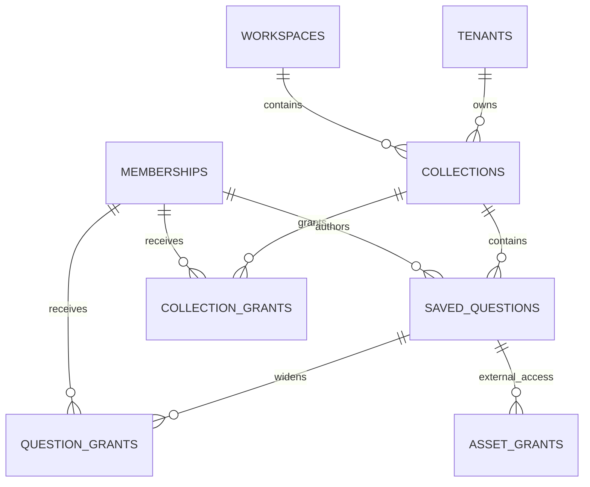

# Data Model: Saved Questions and Collections

**Spec**: [spec.md](./spec.md) | **Constitution**: §4, §5, §6, §7.4, §7.6

## Overview

Feature 5 adds tenant/workspace-scoped **collections**, **saved_questions**, and **question_grants**. It also finalizes collection grant semantics from Feature 2 to `view`/`edit` and uses existing **asset_grants** for external-client saved-question access and export permission.

Next.js has no direct database access to these tables. FastAPI resolves membership, applies permission rules, and delegates execution/export to the Feature 4 query engine.

## Entity: `collections`

Flat workspace container for saved questions.

| Column | Type | Notes |
|--------|------|-------|
| `id` | UUID PK | Generated by database |
| `tenant_id` | UUID NOT NULL | FK → `tenants.id`; every collection is tenant-bound |
| `workspace_id` | UUID NOT NULL | FK → `workspaces.id`; must belong to same tenant |
| `name` | TEXT NOT NULL | Unique within workspace after trimming |
| `slug` | TEXT NOT NULL | Stable locator unique within workspace |
| `sort_order` | INTEGER NOT NULL | Default 0; deterministic list ordering with name fallback |
| `created_by_membership_id` | UUID NOT NULL | FK → `memberships.id`; internal author/admin membership |
| `created_at` | TIMESTAMPTZ NOT NULL | Default `now()` |
| `updated_at` | TIMESTAMPTZ NOT NULL | Changes on metadata update |
| `deleted_at` | TIMESTAMPTZ NULL | Soft delete marker |

**Constraints & indexes**

- UNIQUE `(workspace_id, lower(trim(name)))` for active records, implemented with an expression/partial unique index where `deleted_at IS NULL`.
- UNIQUE `(workspace_id, slug)` for active records where `deleted_at IS NULL`.
- FK or composite validation ensures `(tenant_id, workspace_id)` matches `workspaces`.
- Index `(tenant_id, workspace_id, deleted_at, sort_order, name)`.

**Validation rules**

- Name must be non-empty after trimming.
- Duplicate active names within the same workspace are rejected.
- Delete is refused while active saved questions remain in the collection.
- External-client roles cannot manage collections.

## Entity: `collection_grants`

Existing internal collection grant shape reserved in Feature 2; Feature 5 finalizes the permission vocabulary.

| Column | Type | Notes |
|--------|------|-------|
| `id` | UUID PK | Existing |
| `tenant_id` | UUID NOT NULL | FK → `tenants.id` |
| `workspace_id` | UUID NOT NULL | FK → `workspaces.id` |
| `collection_id` | UUID NOT NULL | FK → `collections.id` |
| `membership_id` | UUID NOT NULL | FK → `memberships.id` |
| `permission` | ENUM/TEXT NOT NULL | `view` or `edit` only |
| `created_at` | TIMESTAMPTZ NOT NULL | Existing |

**Constraints & indexes**

- UNIQUE `(collection_id, membership_id)`.
- FK `(tenant_id, workspace_id, collection_id)` → `collections`.
- FK `(tenant_id, workspace_id, membership_id)` → `memberships`.
- Index `(tenant_id, workspace_id, collection_id)`.

**Migration note**

If an earlier migration created `collection_permission` as `read`/`write`/`admin`, Feature 5 migration should align the enum or replace it with a check constraint for `view`/`edit`. Non-production seed/test rows may map `read` → `view` and `write`/`admin` → `edit`.

## Entity: `saved_questions`

Reusable authored analytical question.

| Column | Type | Notes |
|--------|------|-------|
| `id` | UUID PK | Generated by database |
| `tenant_id` | UUID NOT NULL | FK → `tenants.id` |
| `workspace_id` | UUID NOT NULL | FK → `workspaces.id` |
| `collection_id` | UUID NOT NULL | FK → `collections.id`; exactly one collection |
| `title` | TEXT NOT NULL | Non-empty display title |
| `description` | TEXT NULL | Business-facing explanation |
| `sql_text` | TEXT NOT NULL | Author-authored SQL; never exposed to external clients |
| `parameter_schema` | JSONB NOT NULL | Array/object of scalar declarations: name, type, required, optional label/default |
| `created_by_membership_id` | UUID NOT NULL | Original author membership |
| `updated_by_membership_id` | UUID NULL | Last editor membership |
| `created_at` | TIMESTAMPTZ NOT NULL | Default `now()` |
| `updated_at` | TIMESTAMPTZ NOT NULL | Used for stale-update rejection |
| `deleted_at` | TIMESTAMPTZ NULL | Soft delete marker |

**Constraints & indexes**

- FK `(tenant_id, workspace_id, collection_id)` → `collections`.
- FK `(tenant_id, workspace_id, created_by_membership_id)` → `memberships`.
- Index `(tenant_id, workspace_id, collection_id, deleted_at, title)`.
- Index `(tenant_id, workspace_id, deleted_at, updated_at DESC)` for list/detail checks.

**Validation rules**

- Title and SQL text must be non-empty after trimming.
- `collection_id` must reference an active collection in the same tenant/workspace.
- Parameter names must be unique within the question.
- Parameter types limited to `string`, `number`, `boolean`, `date`.
- Runtime bindings may not include unknown parameters and must satisfy required/type rules before execution/export.
- Updates must include the version/last-known `updated_at`; stale updates are rejected if the database row changed since load.

## Entity: `question_grants`

Internal per-question widen beyond inherited collection access.

| Column | Type | Notes |
|--------|------|-------|
| `id` | UUID PK | Generated by database |
| `tenant_id` | UUID NOT NULL | FK → `tenants.id` |
| `workspace_id` | UUID NOT NULL | FK → `workspaces.id` |
| `saved_question_id` | UUID NOT NULL | FK → `saved_questions.id` |
| `membership_id` | UUID NOT NULL | FK → `memberships.id` |
| `permission` | ENUM/TEXT NOT NULL | `view` or `edit` only |
| `created_by_membership_id` | UUID NOT NULL | Granting admin/authoring membership |
| `created_at` | TIMESTAMPTZ NOT NULL | Default `now()` |

**Constraints & indexes**

- UNIQUE `(saved_question_id, membership_id)`.
- FK `(tenant_id, workspace_id, saved_question_id)` → `saved_questions`.
- FK `(tenant_id, workspace_id, membership_id)` → `memberships`.
- Index `(tenant_id, workspace_id, saved_question_id)`.

**Rules**

- Grants widen only. They never deny collection-inherited access.
- External clients do not use `question_grants`; they use `asset_grants`.
- Export is not implied by `view` or `edit`.

## Entity: `asset_grants` for saved questions

Existing external-client explicit asset grant table from Feature 2.

| Field | Feature 5 rule |
|-------|----------------|
| `asset_type` | `question` for saved-question grants |
| `asset_id` | References `saved_questions.id` conceptually; migration may add FK once table exists |
| `can_export` | Separate export permission; defaults false |

**Rules**

- External clients can access only saved questions with explicit `asset_grants` rows.
- External clients never receive `sql_text`, connection metadata, or collection administration fields.
- External-client export requires `can_export = true`; internal `admin`, `analyst`, and `viewer` export follows visible saved-question access and role rules.

## Entity: saved-question execution request

Not a new table. Runtime request containing:

- `saved_question_id`
- named parameter values
- optional `bypass_cache`
- caller tenant/workspace/membership context

The question service resolves permission, validates parameters, loads `sql_text`, and delegates to Feature 4 `mode: saved_question` execution with audit `saved_question_id`.

## State transitions

```text
collection active --delete requested with active questions--> refused
collection active --delete requested empty--> soft_deleted
collection soft_deleted --normal list--> hidden

saved_question active --edit with current version--> active(updated)
saved_question active --edit with stale version--> refused
saved_question active --delete--> soft_deleted
saved_question active --clone into target collection--> new active question
```

Clone rule: copied business content (`title`, `description`, `sql_text`, `parameter_schema`) becomes a new saved question owned by the cloning membership. Effective permissions come from the target collection plus grants added to the clone; source explicit grants are not copied.

## Relationships



## Migration notes

- Add `collections`, `saved_questions`, and `question_grants` in a Feature 5 Alembic revision or small ordered sequence.
- Add FKs from Feature 4 `query_audit_logs.saved_question_id` to `saved_questions.id` if the earlier migration intentionally deferred it and the migration order permits it.
- Add FK from `asset_grants(asset_type='question', asset_id)` only if the chosen database strategy can enforce typed polymorphic references safely; otherwise document service-level validation and maintain indexes.
- Update ORM models and permission service to use `view`/`edit` collection/question grants.
- Preserve tenant-aware indexes on all list, detail, execute, clone, and export lookup paths.
